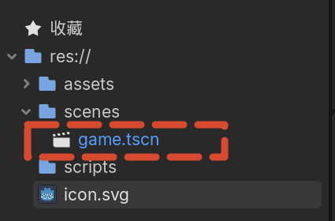
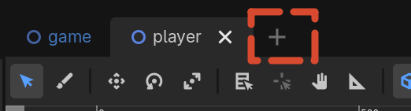
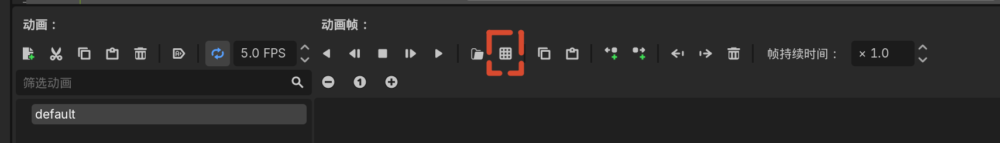
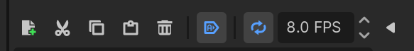
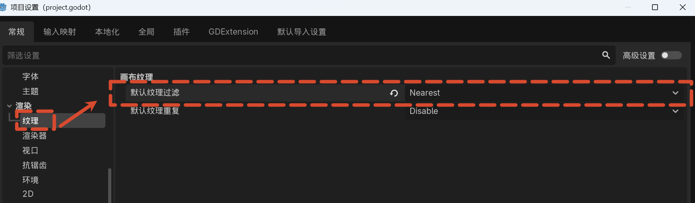
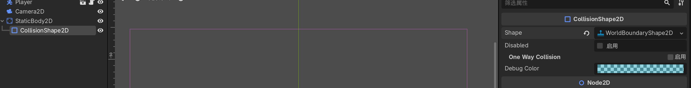
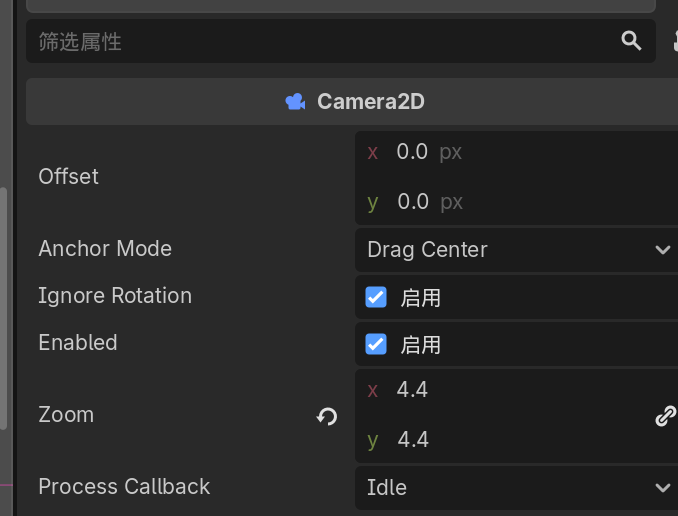

# 02 玩家 1.0 版

## 本节目标

- 创建主游戏场景并设置为主场景
- 创建玩家场景，使用 CharacterBody2D 作为根节点
- 添加动画精灵与碰撞形状
- 添加摄像机跟随玩家
- 实现基础移动与跳跃，并调整手感

## 创建主游戏场景

1. 新建场景，选择 **Node2D** 作为根节点。
2. 将根节点重命名为 **Game**。
3. 按 `Ctrl + S` 保存到 `scenes` 文件夹，命名为 `game.tscn`。
4. 点击播放按钮（或按 `F5`），会提示尚未选择主场景。
5. 点击 **选择当前** 将 `game.tscn` 设置为主场景（主场景为蓝色）。
   
6. 此时运行游戏画面为空，按 `F8` 停止运行。

## 创建玩家场景

1. 新建场景，根节点类型选择 **CharacterBody2D**。
   
2. 将根节点重命名为 **Player**。
3. 保存到 `scenes` 文件夹，命名为 `player.tscn`。

### CharacterBody2D

- 专为通过脚本移动的 2D 角色设计的物理体。
- 适合需要与环境发生碰撞的玩家角色。

### 添加动画精灵

1. 选中 `Player` 节点，添加子节点 **AnimatedSprite2D**。
2. 在 Inspector 中为 **Sprite Frames** 创建 **New SpriteFrames**。
3. 在底部 SpriteFrames 面板中，点击从精灵表添加帧的图标。
   
4. 选择 `assets/sprites/Knight.png`。
5. 该文件是**精灵表（Sprite Sheet）**，将多帧动画打包在一张图中。
6. 配置网格为 **8×8**，使每帧占据一个网格单元。
7. 按顺序点击前 4 帧（闲置动画），点击 **添加帧**。
8. 将 FPS 设置为 **10**。
9. 将动画重命名为 **Idle**，并启用 **自动播放**。
   
10. 将精灵节点向上移动，使角色看起来站在基线上。

### 像素艺术纹理过滤

- 默认的线性过滤会让像素艺术变得模糊。
- 打开 **Project > Project Settings > Rendering > Textures**。
- 将 **Default Texture Filter** 从 `Linear` 改为 `Nearest`。
- 像素艺术会立刻变得清晰锐利。

### 添加碰撞形状

1. 选中 `Player` 节点，添加子节点 **CollisionShape2D**。
2. 在 Inspector 中为 Shape 创建 **CircleShape2D**。
3. 调整碰撞圆的大小和位置，使其比图形稍小一点。
4. 碰撞器不需要非常精确，比图形稍小能避免玩家卡死或产生挫败感。

## 将玩家加入游戏

1. 切换到 `game` 场景。
2. 从文件系统中将 `player.tscn` 拖入场景，放到合适位置。
3. 运行项目，玩家会播放 Idle 动画但会从屏幕掉落。

## 添加地面

1. 在 `game` 场景中添加 **StaticBody2D** 节点作为地面。
2. StaticBody2D 用于不会移动的物体，适合地面和墙壁。
3. 为地面添加 **CollisionShape2D**。
4. Shape 选择 **WorldBoundaryShape2D**，会在水平方向上无限延伸。
   
5. 使用移动工具（`W`）将地面移到玩家下方。
6. 运行游戏，玩家现在可以站在地面上，并使用默认按键移动和跳跃。

## 添加摄像机

1. 在 `Player` 节点下添加子节点 **Camera2D**。
2. 将摄像机移动到玩家正上方。
3. 在 Inspector 中将 **Zoom** 设置为 `(4, 4)`，放大画面。
4. 运行游戏，摄像机将跟随玩家显示画面。

## 调整移动手感

1. 选中 `Player` 节点，点击 **添加脚本** 按钮。
2. 选择 Godot 提供的基础移动模板，保存到 `scripts/player.gd`。
3. 脚本顶部有两个常量：**SPEED** 和 **JUMP_VELOCITY**。
4. 将速度调整为 **130**，跳跃速度调整为 **-300**。
5. 运行游戏，测试移动和跳跃手感。
