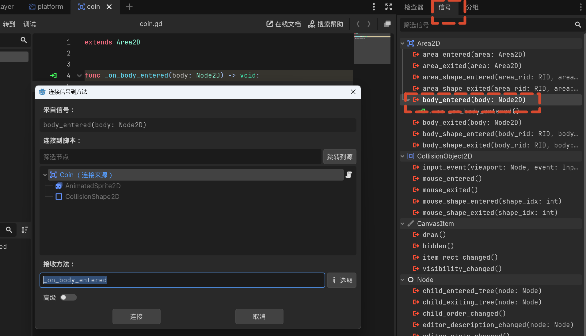

# 05 收集物品

## 本节目标

- 创建金币场景
- 学习 Area2D 的使用
- 使用信号（Signal）检测玩家进入
- 理解碰撞层（Layer）与碰撞遮罩（Mask）
- 实现拾取后移除金币

## 创建金币场景

1. 新建场景，根节点选择 **Area2D**。
2. Area2D 用于检测是否有其它物体进入某个区域，而不是进行物理碰撞。
3. 将根节点重命名为 **Coin**。
4. 保存到 `scenes` 文件夹，命名为 `coin.tscn`。

### 添加金币动画

1. 添加子节点 **AnimatedSprite2D**。
2. 在 Inspector 中为 Sprite Frames 创建 **New SpriteFrames**。
3. 从精灵表加载 `assets/sprites/coin.png`。
4. 该精灵表为 **1 行 × 12 列**。
5. 按顺序添加 12 帧。
6. 将 FPS 设置为 **10**，启用自动播放。

### 添加碰撞区域

1. 添加子节点 **CollisionShape2D**。
2. Shape 选择 **CircleShape2D**。
3. 稍微减小半径，使其与金币大小匹配。

### 放置金币

1. 将 `coin.tscn` 拖入 `game` 场景。
2. 使用 `Ctrl + D` 复制多个金币，分散摆放在关卡中。
3. 运行游戏，金币会播放动画，但玩家碰到后没有反应。

## 第一个脚本

1. 在 `coin` 场景中选中 `Coin` 节点。
2. 点击 **添加脚本**，选择默认模板，保存到 `scripts/coin.gd`。
3. 默认脚本包含 `_ready()` 和 `_process()` 两个函数，当前只有 `pass`（不执行任何操作）。

### `_ready()` 函数

- 节点进入场景树时调用，即游戏开始时。
- 适合放置初始化代码。

### 测试打印

```gdscript
func _ready():
    print("I'm a coin.")
```

- `print()` 会在输出窗口（控制台）显示信息。
- 每个金币实例都会运行一次脚本，因此会打印多次。

## 使用信号检测碰撞

1. 删除 `_ready()` 和 `_process()` 函数（测试完成后它们不再需要）。
2. 选中 `Coin` 节点，切换到编辑器右侧的 **Node** 标签页。
3. 找到 `body_entered` 信号，双击并点击 **连接**。
4. 脚本中会自动生成 `_on_body_entered(body)` 函数，函数名旁有绿色箭头表示由信号触发。
5. 在函数中添加：

```gdscript
func _on_body_entered(body):
    print("+1 coin")
    queue_free()
```

   

- `queue_free()` 会将整个金币场景从游戏中移除。

## 碰撞层与碰撞遮罩

### 问题

- 默认情况下，任何物理体进入金币区域都会触发信号。
- 例如移动平台穿过金币时也会触发。

### 解决方案：物理层级

1. 打开 `player` 场景，选中 `Player` 节点。
2. 在 Inspector 的 **Collision** 中，将 **Collision Layer** 从第 1 层改为第 2 层。
3. 打开 `coin` 场景，选中 `Coin` 节点。
4. 保持 `Coin` 的 Collision Layer 为第 1 层。
5. 将 **Collision Mask** 设置为第 2 层。

### 概念说明

- **Collision Layer（碰撞层）**：定义该节点属于哪个物理层。
- **Collision Mask（碰撞遮罩）**：定义该节点会检测哪些层的物体。
- 玩家位于第 2 层，金币只检测第 2 层，因此只有玩家能触发金币收集。
