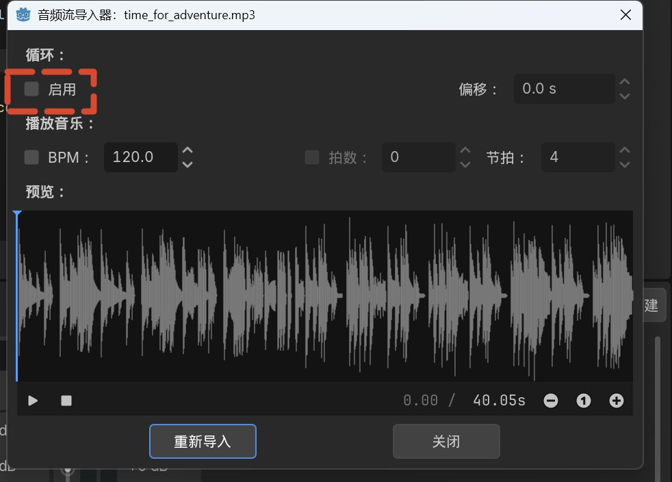
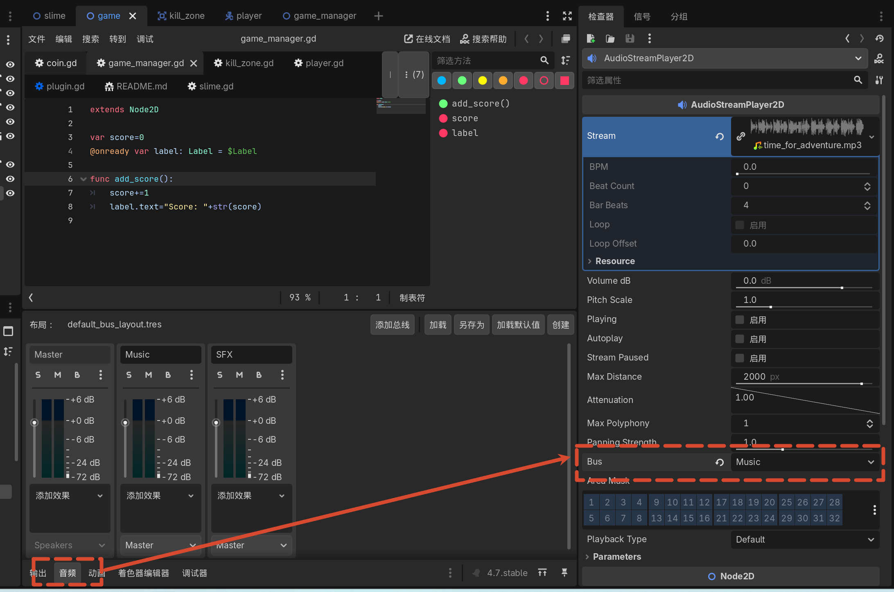
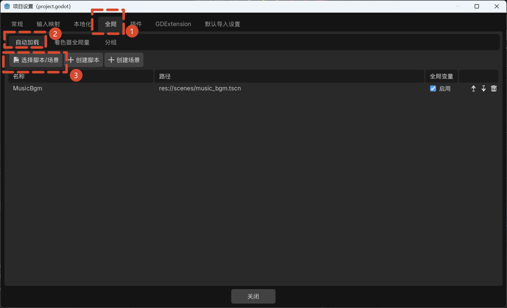

# 13 音频

## 本节目标

- 添加背景音乐并循环播放
- 使用音频总线（Audio Bus）管理音量
- 使用自动加载（AutoLoad）让音乐跨场景持续播放
- 为金币添加拾取音效
- 使用 AnimationPlayer 处理音效与移除的时机

## 添加背景音乐

1. 在 `game` 场景中添加 **AudioStreamPlayer2D** 节点。
2. 重命名为 **MusicBGM**。
3. 将音乐文件（`time_for_adventure.mp3`）拖到 **Stream** 槽中。
4. 启用 **Autoplay**。

### 设置循环

1. 双击音乐文件，打开音频导入器。
2. 启用 **Loop（循环）** 选项。
3. 点击 **Reimport（重新导入）**。



### 调整音量

1. 选中 MusicBGM 节点，在 Inspector 中将 **Bus** 设置为 Music 总线（后续创建）。
2. 或者直接在 AudioStreamPlayer2D 中调整 **Volume dB**。

## 音频总线

1. 点击编辑器底部的 **Audio（音频）** 标签页，打开混音器。
2. 添加两个总线：
   - **Music**：背景音乐
   - **SFX**：音效
3. 将 MusicBGM 节点的 Bus 设置为 **Music**。
4. 通过 Music 总线的滑块控制背景音乐音量，例如设置为 **-12 dB**。



## 自动加载音乐

- 当前场景重新加载时，音乐会重新开始。
- 解决方案：将音乐场景设为自动加载。

1. 将 `MusicBGM` 节点从 `game` 场景拖出，保存为独立场景 `music_bgm.tscn`。
2. 从 `game` 场景中删除 MusicBGM 节点。
3. 打开 **项目 > 项目设置 > 全局（Globals） > 自动加载（AutoLoad）**。
4. 点击 **选择脚本/场景** 图标，选择 `music_bgm.tscn`，点击 **添加（Add）**；自动加载列表中会出现名为 `MusicBgm` 的单例。
5. 运行游戏，音乐会自动加载并播放，即使场景重启也不会中断。



## 添加金币拾取音效

1. 打开 `coin` 场景。
2. 添加 **AudioStreamPlayer** 节点（保持默认名称 `AudioStreamPlayer`；拾取音效不需要空间定位，用非 2D 版本即可）。
3. 将金币音效文件（`coin.wav`）拖到 Stream 槽中。
4. （可选）将 Bus 设置为 **SFX**，以便统一管理音效音量。

### 时机问题

- 如果在 `_on_body_entered` 中直接播放音效并立即 `queue_free()`，音效来不及播放。
- 可以通过代码等待音效播放完毕再移除金币，但会让金币在音效期间仍然可见，容易引起重复拾取。

### 使用 AnimationPlayer 解决

1. 在 `coin` 场景中添加 **AnimationPlayer** 节点。
2. 创建新动画，命名为 **pickup**。

#### 隐藏精灵

1. 选中 `AnimatedSprite2D`。
2. 在动画编辑器中为 **Visibility > Visible** 添加默认关键帧（值为 true）。
3. Godot 会提示创建 **RESET** 轨道，同意即可。
4. 在 pickup 动画中将 Visible 设为 false，并添加关键帧。

#### 禁用碰撞

1. 选中 `CollisionShape2D`。
2. 为 **Disabled** 属性添加默认关键帧（值为 false）。
3. 在 pickup 动画中将 Disabled 设为 true，并添加关键帧。

#### 播放音效

1. 选中 `AudioStreamPlayer`。
2. 为 **Playing** 属性添加默认关键帧（值为 false）。
3. 在 pickup 动画中将 Playing 设为 true，并添加关键帧。

#### 延迟移除

1. 在 pickup 动画的 1 秒处右键插入关键帧。
2. 选择 **Call Method Track**（调用方法轨道）。
3. 目标节点为 `Coin`。
4. 选择方法 `queue_free()`。
5. 1 秒后动画会自动调用 `queue_free()` 移除金币。

### 播放动画

1. 获取 AnimationPlayer 引用：

```gdscript
@onready var animation_player: AnimationPlayer = $AnimationPlayer
```

2. 修改 `_on_body_entered`：

```gdscript
func _on_body_entered(body: Node2D) -> void:
    game_manager.add_score()
    animation_player.play("pickup")
```

- 不再直接调用 `queue_free()`，而是播放 pickup 动画。
- 动画会处理隐藏、禁用碰撞、播放音效和延迟移除。
