# 01 引擎安装与瓦片系统基础

## 引擎下载与安装

- 使用 Godot 4.6.1（GDScript 版本）。**实际上我们使用的是 4.7。**
- 下载网址：[Godot 官网](https://godotengine.org/download/windows/)
- 若需使用 C#，可下载 .NET 版本；本系列以 GDScript 为主。
- 同时下载 Export templates，供后续打包发布使用。这个文件比较大，需要耐心等待。
- 推荐下载免安装便携版，便于多版本管理。
- 初学者建议从官网下载，GitHub Releases 版本较多，容易分心。

## 版本兼容性

- Godot 遵循语义化版本控制。
- 同一主版本下的次版本和补丁版本通常兼容，迁移简单。
- 跨主版本（如 3.x 到 4.x）升级需谨慎。

## 创建项目

1. 打开 Godot，点击 **Create**。
2. 选择项目目录并填写项目名称。
3. 渲染器等设置保持默认。
4. 项目默认打开 3D 视图，点击顶部 **2D** 按钮切换。

   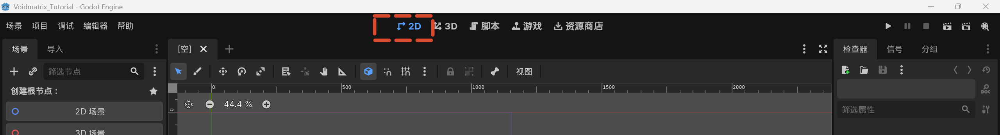

5. 点击 **Create 2D Scene** 创建空场景。

   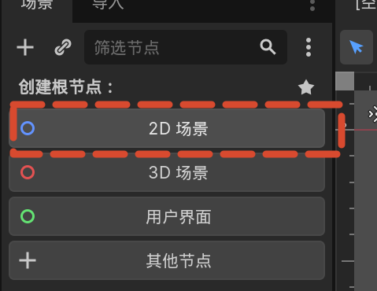

## 节点与场景

- **节点（Node）**：负责特定功能的小部件，如显示图像、处理碰撞、播放声音。
- **场景（Scene）**：由节点组成的树状结构，是可复用的功能单元，可以理解为预制体或蓝图类。
- 运行场景时，先点击上方工具栏的小三角按钮，并选择 **选择当前场景（Run Current Scene）**。场景文件建议放在 `res://scene` 目录下，命名为 `game.tscn`。

  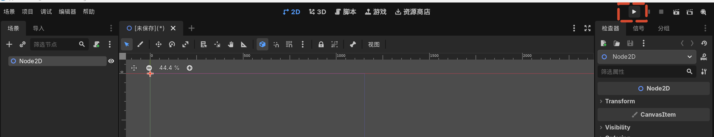

- 角色、子弹、关卡都可以是独立的场景。
- 运行项目时会提示设置 **主场景（Main Scene）**，选择当前场景即可。

## 命名规范

- 文件夹和场景文件使用 **snake_case**（小写加下划线）。
- 节点命名推荐使用 **PascalCase**。按 `F2` 可重命名节点。
- 原因：Windows 和 macOS 默认文件系统不区分大小写，而 Linux 和 Godot 导出的 PCK 虚拟文件系统区分大小写。统一命名规范可避免导出时出现问题。

## 资源导入

- 将素材包 [夸克网盘](https://pan.quark.cn/s/95016ec9f05e) 中的 `resources` 文件夹复制到项目目录下。`res://` 即项目根目录。
- 子文件夹通常包括 `audio`、`fonts`、`textures`。
- Godot 会自动导入这些资源。
- 将纹理拖入场景窗口，Godot 会自动创建对应的 Sprite 节点。

## 纹理过滤

像素游戏需要避免模糊：

- **Project > Project Settings > Rendering > Textures**
- 将默认纹理过滤改为 **Nearest**。

  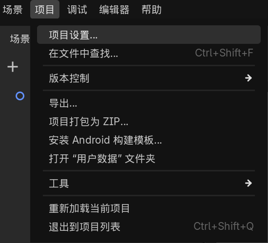

  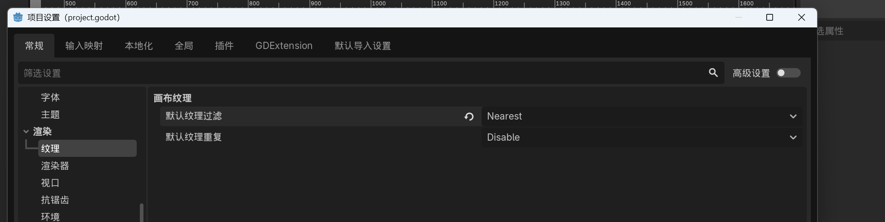

| 过滤方式 | 效果 |
|---------|------|
| Nearest Neighbor | 取最近像素颜色，边缘锐利，适合像素风 |
| Linear | 混合附近像素，边缘柔和，适合非像素风 |

## 瓦片系统

### 核心概念

- **TileMapLayer**：放置瓦片的画布。
- **TileSet**：瓦片资源库，存储瓦片图像及附加信息（碰撞、导航等）。
- **TileMap**：操作瓦片的节点面板。

  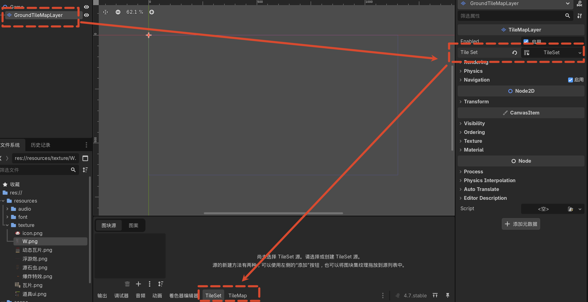

比喻：TileSet 是颜料，TileMap 是调色板，TileMapLayer 是画布。

### 静态瓦片

1. 在 Game 节点下添加子节点 **TileMapLayer**。
2. 命名为 `GroundTileMapLayer`。
3. 在 Inspector 中为 Tile Set 创建 **New TileSet**。
4. 进入 TileSet 面板，添加 Atlas，选择静态瓦片纹理。
5. 自动切分瓦片。
6. 切换到 TileMap 面板，选择瓦片并在场景中绘制。
7. 可用矩形工具快速填充基础区域。

   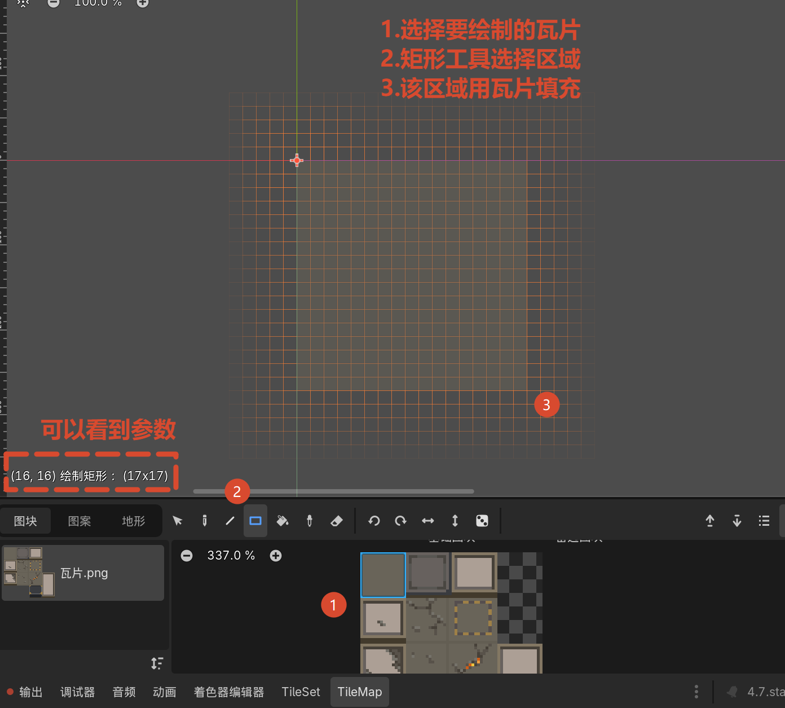

### 动态瓦片

1. 在 TileSet 面板添加动态瓦片纹理，选择 **不自动创建瓦片**。
2. 删除自动生成的瓦片（如有）。
3. 进入 Settings，框选动画帧所在的格子。
4. 在 Select 面板中设置动画属性：
   - **Speed**：每秒播放帧数。
   - **Mode**：同步播放（Synced）或随机播放（Random），用于控制同一画面中多个动态瓦片是否同步。
5. 在 Frames 中添加后续帧。
6. 回到 TileMap 面板绘制动态瓦片。

   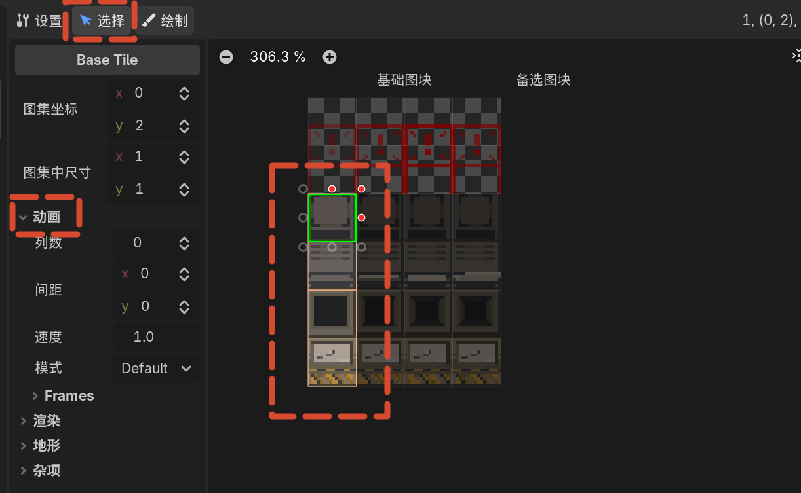

### 装饰瓦片层

- 创建第二个 TileMapLayer，命名为 `OverlayTileMapLayer`。
- 装饰瓦片尺寸可能与基础瓦片不同（如 16×32）。

  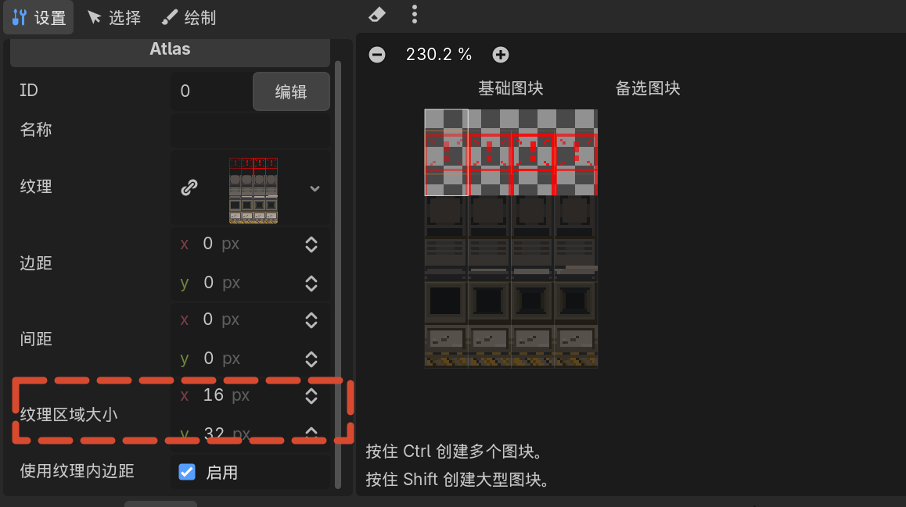

- 在 TileSet 的 **Texture Region Size** 中将 Y 改为 32，使纵向两格合并为一个完整帧。
- 设置动画并绘制。

## 摄像机 Camera2D

- 在 Game 根节点下添加 **Camera2D**。
- **Offset**：调整摄像机位置。16×16 瓦片、每格 16 像素的地图总像素为 256×256，中心点为 128×128。
- **Zoom**：放大显示。设为 (2, 2) 表示画面放大两倍。

  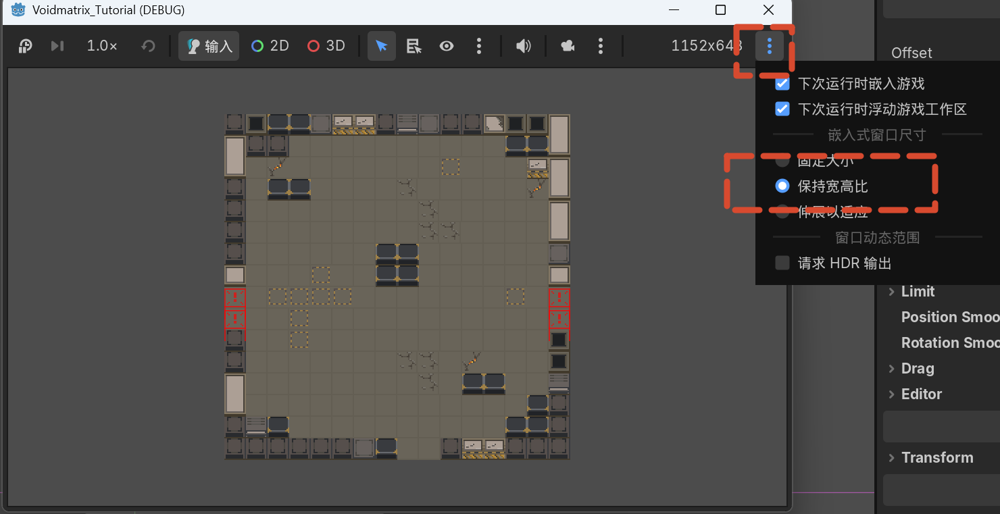

  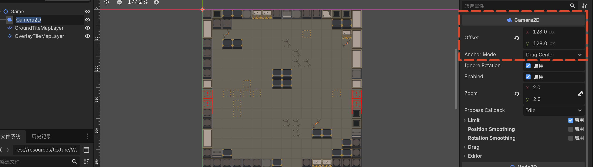

## 窗口拉伸与背景色

- **Project > Project Settings > Display > Window > Stretch Mode**
  - `disabled`：场景单位与屏幕像素一一对应。
  - `canvas_items`：2D 视图随窗口缩放，适合游戏。
- **Rendering > Environment > Default Clear Color**
  - 可修改默认背景颜色，例如 RGB(15, 15, 15) 设为接近纯黑的深色。

  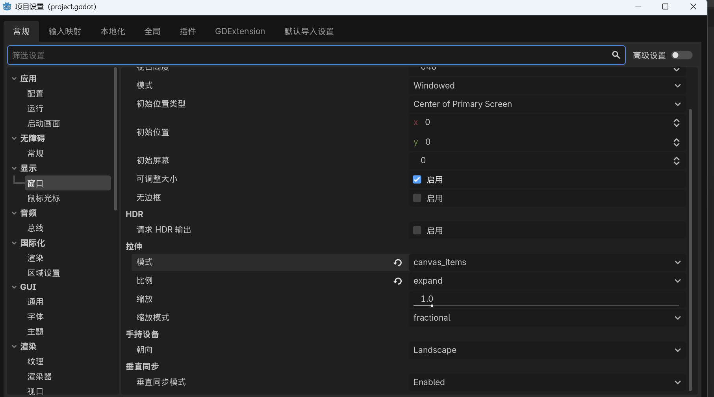

## 下节预告

下一节创建玩家角色，并为地图瓦片添加碰撞规则。
