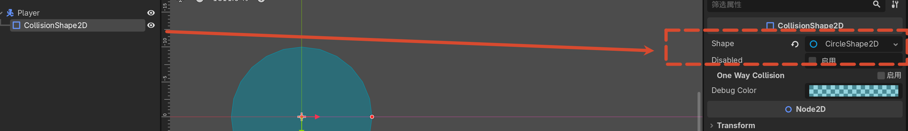
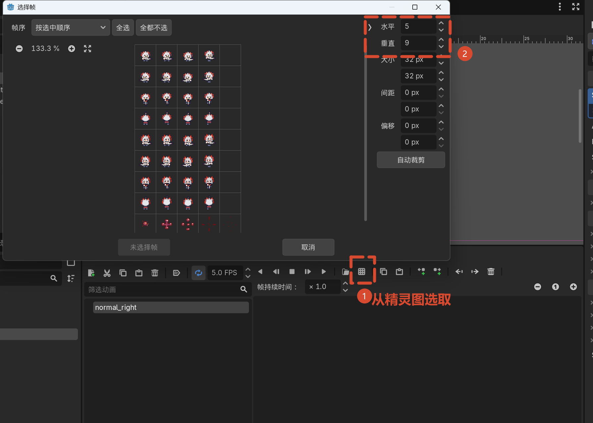
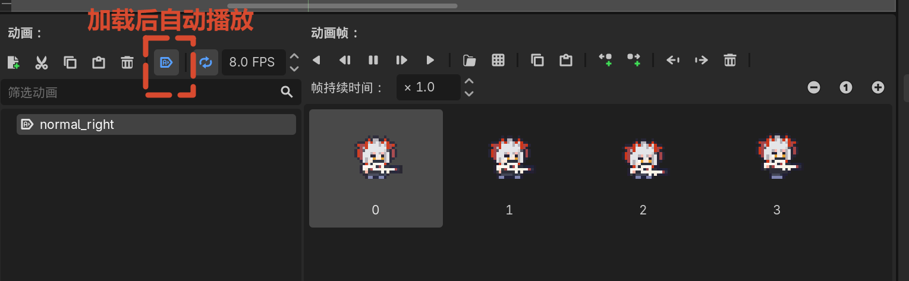
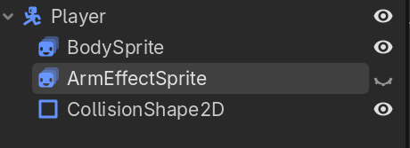
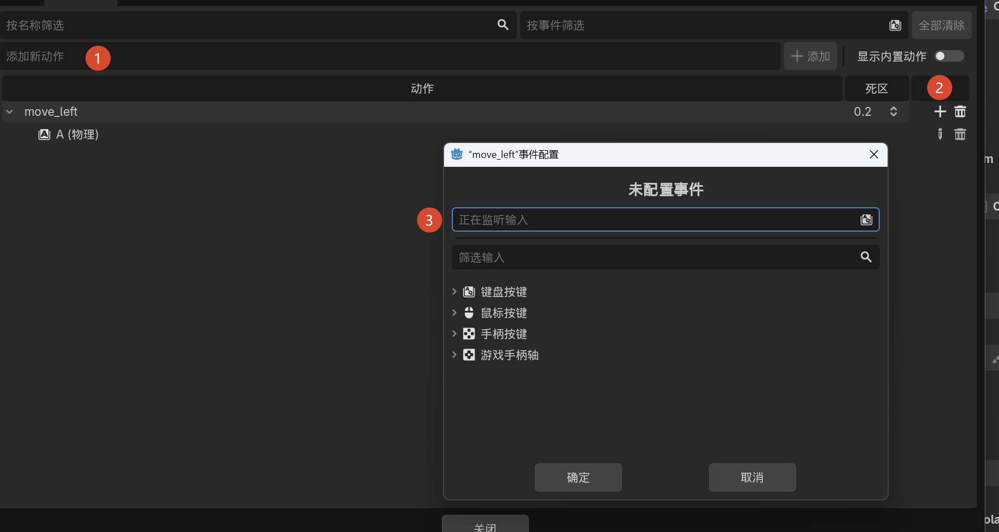
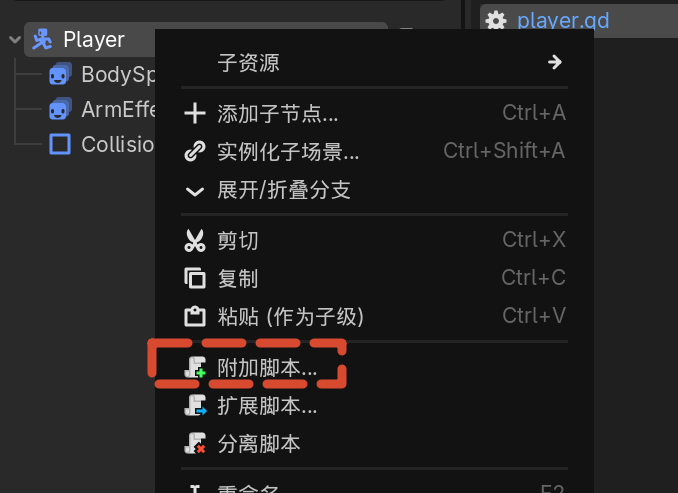
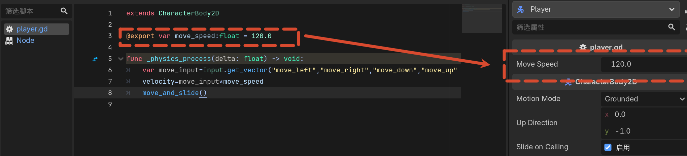
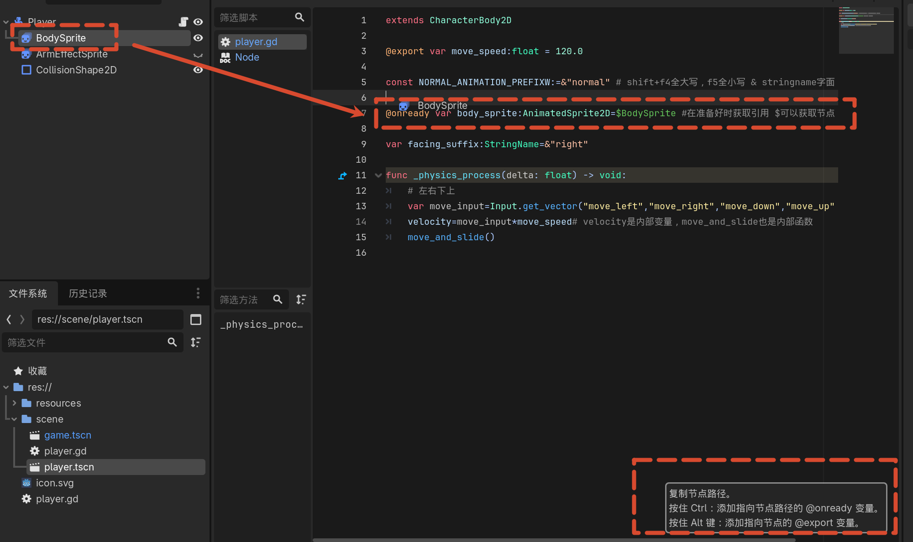
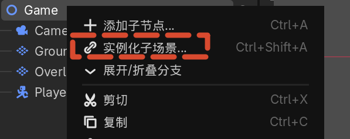

# 02 玩家角色动画与移动基础

## 创建玩家场景

1. 在文件系统 `scenes` 目录上右键，选择 **新建场景**。
2. 根节点类型选择 **CharacterBody2D**。
3. 场景命名为 `player`。

## 节点类型选择

| 节点 | 用途 |
|-----|------|
| Node2D | 基础变换节点，描述位置、旋转、缩放，无物理和碰撞能力 |
| CharacterBody2D | 适合脚本控制的物理体，内置移动、碰撞、滑动处理，适合玩家角色 |
| RigidBody2D | 适合完全由物理模拟驱动的物体，如箱子、石头、被炸飞的杂物 |

- 需要手感调优和响应外部输入的角色，优先使用 **CharacterBody2D**。
- 只需按物理规则运动的物体，使用 **RigidBody2D**。

## Godot 的组合式设计

- Godot 不推荐把所有功能塞进一个巨大的类。
- 通过子节点组合功能：显示图像的节点、碰撞范围的节点、检测触发的节点、播放声音的节点等。
- 场景树中的子节点可以理解为场景对象的功能模块。

## 添加碰撞外形

1. 在 `Player` 节点上右键，选择 **添加子节点**，添加 **CollisionShape2D**。
2. 在 Inspector 中为 Shape 创建形状资源，例如 **CircleShape2D**。
3. 在场景中调整碰撞形状大小和位置。



## 添加角色动画

### AnimatedSprite2D

1. 在 `Player` 节点上添加子节点 **AnimatedSprite2D**。
2. 命名：
   - `BodySprite`：玩家本体动画
   - `ArmEffectSprite`：浮游炮强化特效动画
3. 将动画节点拖到碰撞节点之前，方便在编辑器中预览碰撞范围。从上往下渲染，让 collision 在上方。

### SpriteFrames 动画帧

1. 选中 `BodySprite`，在 Inspector 中为 **Sprite Frames** 创建 **New SpriteFrames**。
2. 在底部面板中为动画命名：
   - `normal_right`、`normal_left`、`normal_up`、`normal_down`：未强化状态四方向移动动画
   - `armed_right`、`armed_left`、`armed_up`、`armed_down`：强化状态四方向移动动画
   - `death`：死亡动画
3. 从精灵表中添加帧：
   - 选择素材图片。

   - 设置网格行列数（例如 5×9）。
   - 框选对应帧，点击添加。
4. 每个动画速度设置为 **8 FPS**。
5. 将默认播放的动画设为对应标签。

6. 这几种是互斥的状态，所以可以放到一个节点下。

### 浮游炮动画

- `ArmEffectSprite` 只有一行，共 8 帧。
- 设置 8 FPS，默认隐藏（点击场景树中的眼睛图标切换可见性）。


## GDScript 学习建议

- GDScript 与 Godot 结合紧密，语法相对简单。
- 官方文档提供交互式入门教程，推荐按顺序学习。
- 重点参考：
  - 创建第一个脚本
  - GDScript 参考
  - 动态语言入门
  - 导出属性

## 输入映射

1. 打开 **Project > Project Settings > Input Map**。

2. 添加动作：
   - `move_left`：A 键
   - `move_right`：D 键
   - `move_up`：W 键
   - `move_down`：S 键
3. 输入映射将按键与逻辑解耦，代码中只检测动作是否触发。

## 玩家移动脚本

添加方式：选中节点，右键，附加脚本。



```gdscript
extends CharacterBody2D

@export var move_speed: float = 120.0

const NORMAL_ANIMATION_PREFIX := &"normal"  # shift+f4 全大写，f5 全小写；& 为 StringName 字面量，提升性能；:= 为静态类型推断

@onready var body_sprite: AnimatedSprite2D = $BodySprite  # 在节点准备好时获取引用，$ 可获取子节点引用

var facing_suffix: StringName = &"right"

func _ready() -> void:
    _update_animation()

func _physics_process(delta: float) -> void:
    # 左右下上
    var move_input := Input.get_vector("move_left", "move_right", "move_down", "move_up")
    velocity = move_input * move_speed  # velocity 是内部变量，move_and_slide 也是内部函数
    move_and_slide()

    if move_input != Vector2.ZERO:
        facing_suffix = _vector_to_facing_suffix(move_input)

    _update_animation()


func _update_animation() -> void:
    var animation_name := StringName("%s_%s" % [NORMAL_ANIMATION_PREFIX, facing_suffix])

    if not body_sprite.sprite_frames.has_animation(animation_name):
        push_warning("Missing Animation : %s" % animation_name)
        return

    if body_sprite.animation != animation_name:
        body_sprite.play(animation_name)

func _vector_to_facing_suffix(move_direction: Vector2) -> StringName:
    if abs(move_direction.x) >= abs(move_direction.y):
        return &"right" if move_direction.x > 0 else &"left"

    return &"down" if move_direction.y > 0 else &"up"
```

### @export 导出属性

```gdscript
@export var move_speed: float = 120.0
```

- 使用 `@export` 将变量暴露到编辑器 Inspector 中。
- 速度、生命值、防御力等可能频繁调整的数值都适合导出。



### physics_process 与 process

- **_process(delta)**：跟随画面刷新率调用，适合视觉表现、镜头效果等不依赖物理精度的逻辑。
- **_physics_process(delta)**：跟随物理刷新调用（默认 60 FPS），适合移动、速度计算、碰撞等物理相关逻辑。

### 移动实现

```gdscript
func _physics_process(delta: float) -> void:
    # 左右下上
    var move_input := Input.get_vector("move_left", "move_right", "move_down", "move_up")
    velocity = move_input * move_speed
    move_and_slide()
```

- `Input.get_vector()` 根据四个方向动作返回标准化移动向量。
- 参数顺序为负 X、正 X、负 Y、正 Y，因此输入动作依次是 `move_left`、`move_right`、`move_down`、`move_up`。
- `velocity` 是 CharacterBody2D 的内置成员变量，包含大小和方向。
- `move_and_slide()` 根据 velocity 执行移动和碰撞滑动。

### 常量与节点引用

```gdscript
const NORMAL_ANIMATION_PREFIX := &"normal"

@onready var body_sprite: AnimatedSprite2D = $BodySprite

var facing_suffix: StringName = &"right"
```

- `&"normal"` 是 StringName 字面量，用于固定名称，性能和语义更好。
- `@onready` 在节点准备就绪时获取子节点引用。
- 也可以按住 Ctrl 从场景树拖拽节点到代码编辑器自动生成引用代码。



### _ready 初始化

```gdscript
func _ready() -> void:
    _update_animation()
```

- `_ready()` 在节点实例化进入场景后调用。
- 调用 `_update_animation()` 进行初始状态兜底。

### 根据输入更新朝向

```gdscript
func _physics_process(delta: float) -> void:
    var move_input := Input.get_vector("move_left", "move_right", "move_down", "move_up")
    velocity = move_input * move_speed
    move_and_slide()

    if move_input != Vector2.ZERO:
        facing_suffix = _vector_to_facing_suffix(move_input)

    _update_animation()
```

- 只有在存在输入时才更新朝向，避免按键抬起时动画跳回默认方向。
- 无输入时仍会调用 `_update_animation()`，保持当前朝向动画继续播放。

### 更新动画函数

```gdscript
func _update_animation() -> void:
    var animation_name := StringName("%s_%s" % [NORMAL_ANIMATION_PREFIX, facing_suffix])

    if not body_sprite.sprite_frames.has_animation(animation_name):
        push_warning("Missing Animation : %s" % animation_name)
        return

    if body_sprite.animation != animation_name:
        body_sprite.play(animation_name)
```

- 使用 `StringName` 构造动画名，避免运行时反复创建字符串。
- 如果动画不存在，输出警告并跳过，避免崩溃。

### 计算朝向后缀

```gdscript
func _vector_to_facing_suffix(move_direction: Vector2) -> StringName:
    if abs(move_direction.x) >= abs(move_direction.y):
        return &"right" if move_direction.x > 0 else &"left"

    return &"down" if move_direction.y > 0 else &"up"
```

- 优先使用分量更大的坐标轴决定朝向；x 与 y 相等时偏向水平方向。
- 返回 StringName，与动画名构造的类型保持一致。
- 这种写法兼容键盘和手柄摇杆等多种输入设备。

## 实例化玩家到游戏场景

1. 切换到 `game` 场景。
2. 在根节点上右键，选择 **实例化子场景**。
3. 选择 `player.tscn`，将其拖到地图合适位置。
4. 运行项目，按 WASD 测试移动。



## 下节预告

下一节为地图瓦片和障碍物添加碰撞阻挡效果。
