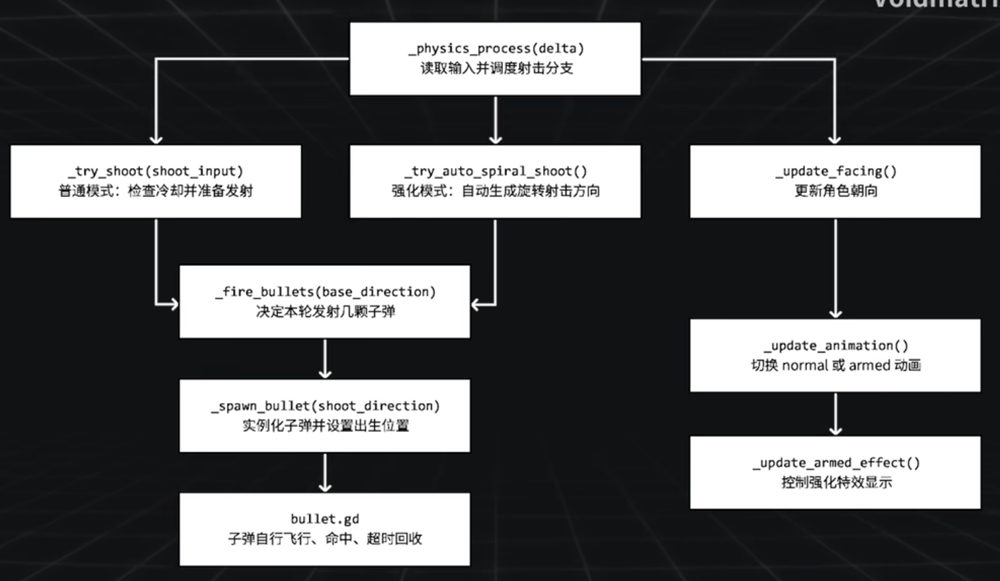

# 04 玩家射击系统

## 输入映射

1. 打开 **Project > Project Settings > Input Map**。
2. 添加四个射击方向动作：
   - `shoot_left`：左方向键
   - `shoot_right`：右方向键
   - `shoot_up`：上方向键
   - `shoot_down`：下方向键
3. 斜向射击由代码根据这四个方向组合计算。

系统架构图


## 添加射击冷却计时器

1. 在 `player` 场景中根节点下添加 **Timer** 节点。
2. 命名为 `ShootTimer`。
3. 本视频中不直接使用 `timeout` 信号，而是作为冷却状态计时器查询使用。

## 射击系统需求

- 两种射击模式：
  - **指向性射击**：按方向键向指定方向发射。
  - **螺旋射击**：吃到强化道具后自动向四周旋转发射弹幕。
- 两种模式的子弹数量、冷却时间不同。
- 指向性射击可受射击加速道具影响。
- 角色动画朝向由射击方向优先于移动方向决定，支持倒着走路并向前射击。

## 函数调用链路

```
_physics_process()
├── _try_auto_spiral_shoot()  # 螺旋模式下自动发射
│   └── _fire_bullet()
│       └── _spawn_bullet()
├── _try_shoot()              # 指向性射击
│   └── _fire_bullet()
│       └── _spawn_bullet()
├── _update_facing()          # 根据射击/移动优先级更新朝向
├── _update_animation()       # 根据形态和朝向后缀播放动画
└── _update_armed_animation() # 更新浮游炮特效
```

拆分的目的是让输入判断、子弹生成、动画表现相互独立，便于后续扩展更多攻击模式或道具 Buff。

## Player 脚本关键实现

### 常量与变量

```gdscript
# 动画相关
const NORMAL_ANIMATION_PREFIX := &"normal"
@onready var body_sprite: AnimatedSprite2D = $BodySprite
var facing_suffix: StringName = &"right"

# 射击相关
const BULLET_SCENE := preload("res://scene/bullet.tscn")
const ARMED_ANIMATION_PREFIX := &"armed"
const DEFAULT_FIRE_RATE_MULTIPLIER := 1.0
const SPRIRAL_PHASE_STEP := PI / 12

# 实际上是枚举，用常量表示形态和弹幕模式
const PLAYER_FORM_MODE_NORMAL := 0
const PLAYER_FORM_MODE_ARMED := 1
const SHOT_PATTERN_NORMAL := 0
const SHOT_PATTERN_SPIRAL := 1

@export var fire_interval: float = 0.18  # 连续开火之间的最短间隔
@export var bullet_spawn_distance: float = 18.0  # 子弹生成时相对玩家中心的偏移距离

@onready var arm_effect_sprite: AnimatedSprite2D = $ArmEffectSprite
@onready var shoot_timer: Timer = $Timer

var rapid_fire_rate_multiplier: float = DEFAULT_FIRE_RATE_MULTIPLIER  # 普通射速倍率
var form_fire_rate_multiplier: float = DEFAULT_FIRE_RATE_MULTIPLIER  # 强化形态自带的射速倍率
var current_form_mode: int = PLAYER_FORM_MODE_NORMAL  # 当前玩家形态
var current_shot_pattern: int = SHOT_PATTERN_NORMAL  # 当前弹幕模式
var spiral_phase: float = 0.0  # 螺旋弹幕的相位，用来让连续射击形成旋转感
```

- `BULLET_SCENE`：预加载子弹场景，作为实例化模板。
- `bullet_spawn_distance`：子弹出生点相对玩家中心的偏移，模拟从枪口射出。
- `current_form_mode` / `current_shot_pattern`：用整数常量代替布尔值，便于后续扩展更多形态或弹幕模式。
- `rapid_fire_rate_multiplier` / `form_fire_rate_multiplier`：分别控制普通射速倍率和强化形态射速倍率。

### _ready 初始化

```gdscript
func _ready() -> void:
    #current_form_mode = PLAYER_FORM_MODE_ARMED
    #current_shot_pattern = SHOT_PATTERN_SPIRAL
    #form_fire_rate_multiplier = 20.0

    shoot_timer.one_shot = true
    shoot_timer.wait_time = _get_effective_fire_interval()
    _update_animation()
    _update_armed_effect()
```

### _physics_process

```gdscript
func _physics_process(delta: float) -> void:
    # 左右下上
    var move_input := Input.get_vector("move_left", "move_right", "move_down", "move_up")
    var shoot_input := Input.get_vector("shoot_left", "shoot_right", "shoot_down", "shoot_up")

    velocity = move_input * move_speed
    move_and_slide()

    if current_shot_pattern == SHOT_PATTERN_SPIRAL:
        _try_auto_spiral_shoot()
    elif shoot_input != Vector2.ZERO:
        _try_shoot(shoot_input)

    if move_input != Vector2.ZERO:
        facing_suffix = _vector_to_facing_suffix(move_input)

    _update_facing(move_input, shoot_input)
    _update_animation()
    _update_armed_animation()
```

### 更新动画

```gdscript
func _update_animation() -> void:
    var animation_name := StringName("%s_%s" % [NORMAL_ANIMATION_PREFIX, facing_suffix])

    if not body_sprite.sprite_frames.has_animation(animation_name):
        var fallback_animation = StringName("%s_%s" % [NORMAL_ANIMATION_PREFIX, facing_suffix])
        if not body_sprite.sprite_frames.has_animation(fallback_animation):
            push_warning("Missing Animation : %s" % animation_name)
            return
        animation_name = fallback_animation

    if body_sprite.animation != animation_name:
        body_sprite.play(animation_name)
```

### 获取动画前缀

```gdscript
func _get_animation_prefix() -> StringName:
    if current_form_mode == PLAYER_FORM_MODE_ARMED:
        return ARMED_ANIMATION_PREFIX
    return NORMAL_ANIMATION_PREFIX
```

### 更新朝向

```gdscript
func _update_facing(move_input: Vector2, shoot_input: Vector2) -> void:
    # 螺旋发射的时候不需要按射击方向更改武器动画
    if current_shot_pattern == SHOT_PATTERN_SPIRAL:
        if move_input != Vector2.ZERO:
            facing_suffix = _vector_to_facing_suffix(move_input)
        return

    if shoot_input != Vector2.ZERO:
        facing_suffix = _vector_to_facing_suffix(shoot_input)
    elif move_input != Vector2.ZERO:
        facing_suffix = _vector_to_facing_suffix(move_input)
```

- 射击方向优先于移动方向决定动画朝向。
- 螺旋模式下不读取射击按键，按移动方向更新强化动画朝向。

### 指向性射击

```gdscript
func _try_shoot(shoot_input: Vector2) -> void:
    if not shoot_timer.is_stopped():
        return

    var shoot_dirc := shoot_input.normalized()
    var has_spawn_bullet := _fire_bullet(shoot_dirc)
    if has_spawn_bullet:
        shoot_timer.start(_get_effective_fire_interval())
```

### 螺旋射击

```gdscript
func _try_auto_spiral_shoot() -> void:
    if not shoot_timer.is_stopped():
        return

    var spiral_dirc := Vector2.RIGHT.rotated(spiral_phase)
    var has_spawn_bullet := _fire_bullet(spiral_dirc)
    if has_spawn_bullet:
        shoot_timer.start(_get_effective_fire_interval())
```

### 开火分发

```gdscript
func _fire_bullet(shoot_dirc: Vector2) -> bool:
    if current_shot_pattern == SHOT_PATTERN_SPIRAL:
        var has_spawn_up := _spawn_bullet(shoot_dirc)
        var has_spawn_down := _spawn_bullet(shoot_dirc.rotated(PI))
        spiral_phase = wrapf(spiral_phase + SPRIRAL_PHASE_STEP, 0.0, TAU)
        return has_spawn_up or has_spawn_down
    return _spawn_bullet(shoot_dirc)
```

- 螺旋模式下同时发射方向相反的两颗子弹，形成对称弹幕。
- `wrapf(..., 0.0, TAU)` 保证相位在 0 到 2π 之间循环。

### 实例化单颗子弹

```gdscript
func _spawn_bullet(shoot_dirc: Vector2) -> bool:
    var bullet := BULLET_SCENE.instantiate() as Bullet
    if bullet == null:
        return false

    bullet.top_level = true
    bullet.setup(shoot_dirc)

    var spawn_parent := get_tree().current_scene
    if spawn_parent == null:
        return false

    spawn_parent.add_child(bullet)
    bullet.global_position = global_position + shoot_dirc * bullet_spawn_distance
    return true
```

- `top_level = true` 让子弹不受父节点变换影响。
- 子弹挂载到当前场景根节点，而不是玩家节点下，避免玩家移动影响子弹位置。
- 使用 `bullet_spawn_distance` 让子弹从角色边缘出生。

### 辅助函数

```gdscript
func _get_effective_fire_rate_multiplier() -> float:
    if _has_active_form_override():
        return maxf(form_fire_rate_multiplier, 0.01)
    return maxf(rapid_fire_rate_multiplier, 0.01)

# 只要玩家仍处于特殊形态或特殊弹幕模式，就视为强化仍在生效。
func _has_active_form_override() -> bool:
    return (
        current_form_mode != PLAYER_FORM_MODE_NORMAL
        or current_shot_pattern != SHOT_PATTERN_NORMAL
    )

func _get_effective_fire_interval() -> float:
    var fire_rate_multiplier := form_fire_rate_multiplier if current_form_mode == PLAYER_FORM_MODE_NORMAL else rapid_fire_rate_multiplier
    return fire_rate_multiplier * fire_interval
```

### 更新浮游炮特效

```gdscript
func _update_armed_effect() -> void:
    return

func _update_armed_animation() -> void:
    var is_armed = (current_form_mode == PLAYER_FORM_MODE_ARMED)

    if not is_armed:
        if arm_effect_sprite.is_playing():
            arm_effect_sprite.stop()
        if arm_effect_sprite.visible:
            arm_effect_sprite.visible = false
        return

    if not arm_effect_sprite.visible:
        arm_effect_sprite.visible = true
    if arm_effect_sprite.is_playing():
        return
    if arm_effect_sprite.sprite_frames.has_animation(&"default"):
        arm_effect_sprite.play(&"default")
```

- `_update_armed_effect()` 当前为空实现，预留为后续扩展。
- `_update_armed_animation()` 控制浮游炮特效的显示与播放。

## 调试螺旋射击

在 `_ready()` 中临时取消以下注释可预览强化效果：

```gdscript
current_form_mode = PLAYER_FORM_MODE_ARMED
current_shot_pattern = SHOT_PATTERN_SPIRAL
form_fire_rate_multiplier = 20.0
```

测试完毕后重新注释，避免影响后续开发。

## 下节预告

下一节开始制作道具 Buff 系统和敌人。
