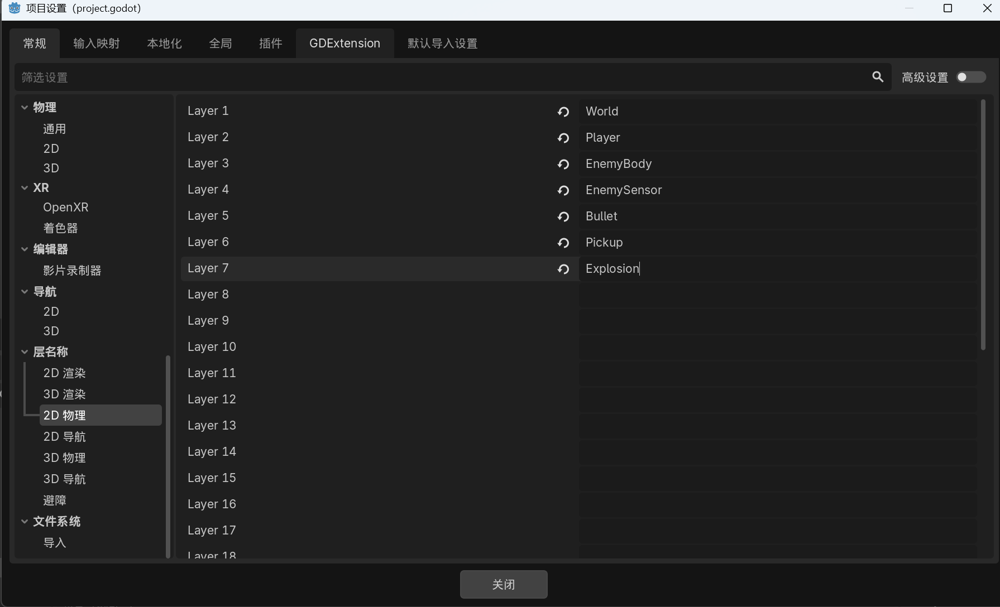
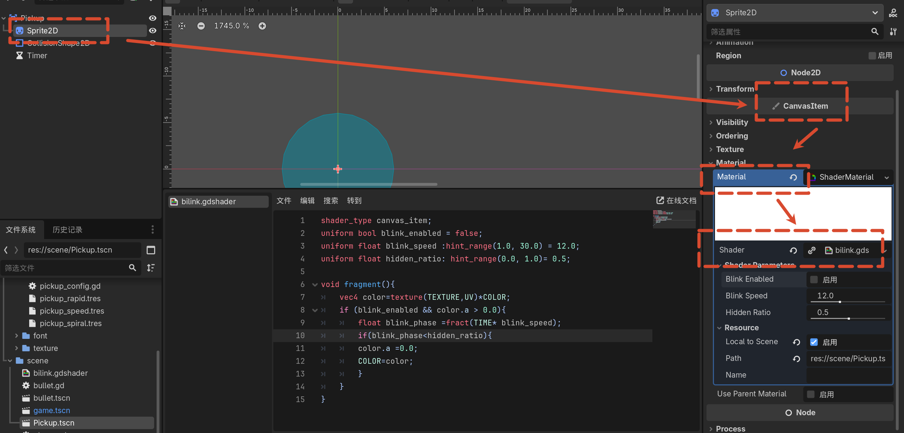

# 05 道具 Buff 系统

## 道具系统概述

游戏中三种道具：

- 提升移动速度
- 提升射击频率
- 进入武装强化状态（螺旋射击）

敌人被击杀后按权重概率掉落。

## 物理层设计

### 物理层作用

物理层在引擎层面对碰撞对象进行筛选，只有符合规则的目标才会传递到脚本层。避免在脚本中写大量 `if` 过滤，也避免敌人拾取道具、子弹击毁道具等错误交互。

### Layer 与 Mask

- **Layer**：我属于哪一类。
- **Mask**：我关心哪一类，会主动与哪一类发生交互。

### 项目物理层命名

打开 **Project > Project Settings > 2D Physics > Layer Names**，设置以下 7 层：

| 层级 | 名称 | 用途 |
|-----|------|------|
| 1 | world | 地图、墙壁、障碍物、空气墙，限制玩家、敌人、子弹移动 |
| 2 | player | 玩家本体 |
| 3 | enemy_body | 敌人碰撞实体，与世界产生物理阻挡 |
| 4 | enemy_sensor | 敌人伤害检测区域，检测是否碰到玩家 |
| 5 | bullet | 子弹 |
| 6 | pick_up | 道具 |
| 7 | explosion | 敌人自爆范围，伤害玩家和周围敌人 |

为什么把敌人拆成 `enemy_body` 和 `enemy_sensor`？

- `enemy_body`：负责与地图的物理阻挡。
- `enemy_sensor`：负责检测接触伤害。
- 职责不同，拆开后逻辑更清晰。



### 物理层划分思路

1. 列出游戏中的对象身份：玩家、敌人、子弹、障碍物、道具等。
2. 列出它们之间需要发生的关系：玩家撞墙、子弹打敌人、玩家拾取道具、敌人碰玩家等。
3. 把不同职责的碰撞拆开，如敌人的身体与伤害检测区域。

### 玩家与子弹的层级设置

**Player 根节点：**

- Layer：`player`（第 2 层）
- Mask：`world`（第 1 层）

> 玩家不需要勾选 `enemy_body` 或 `enemy_sensor`。CharacterBody2D 的 Mask 决定移动时被哪些障碍物挡住。玩家被敌人伤害属于触发检测，由敌人的 Area2D 主动检测并调用玩家受伤接口。

**Bullet 根节点：**

- Layer：`bullet`（第 5 层）
- Mask：`world`（第 1 层）

> 子弹命中敌人由敌人的 Area2D 检测子弹，而不是子弹去检测敌人，避免命中逻辑被触发两次。子弹脚本中的 `WORLD_COLLISION_MASK` 常量用于射线检测防止穿过薄障碍物，与节点属性上的 Mask 不同。

## 资源配置驱动设计

### 设计思路

道具的共同逻辑（如何刷新、渲染、碰撞、拾取）由场景和脚本统一处理；差异化的效果（持续时间、数值强度、形态切换）由 Resource 配置。

优势：

- 新增道具只需创建配置资源。
- 调整参数在编辑器中完成，不需要改代码。

### 道具图标 AtlasTexture

1. 在 `resources` 下新建 `atlas` 文件夹。
2. 右键新建资源，搜索 **AtlasTexture**。
3. 创建三个资源：
   - `pickup_rapid`：射速提升图标
   - `pickup_speed`：移速提升图标
   - `pickup_spiral`：螺旋强化图标
4. 选择 `resources/texture/道具ui.png`，编辑区域选取对应图标。
5. 如果相邻道具被自动合并，切换为栅格吸附，按 8×8 或 16×16 选取。

### 道具配置脚本

在 `resources/config` 下创建 `pickup_config.gd`，继承 **Resource**：

```gdscript
class_name PickupConfig
extends Resource

enum PickupType {
    SPEED,
    RAPID,
    SPIRAL
}

enum PlayerFormMode {
    NORMAL,
    ARAMED
}

enum ShootPattern {
    NORMAL,
    SPIRAL
}

@export_group("基础信息")
@export var pickup_type: PickupType = PickupType.SPEED
@export var display_name: String = "移速道具"
@export_range(0.0, 1000.0, 0.1, "or_greater") var drop_weight: float = 1.0

@export_group("显示资源")
@export var icon_texture: Texture2D

@export_group("Buff效果")
@export_range(0.0, 120.0, 0.1, "or_greater") var duration: float = 5.0
@export_range(0.1, 5.0, 0.05, "or_greater") var move_speed_multiplier: float = 1.0
@export_range(0.1, 5.0, 0.05, "or_greater") var fire_rate_multiplier: float = 1.0

@export_group("形态与弹幕")
@export var player_form_mode: PlayerFormMode = PlayerFormMode.NORMAL
@export var shot_pattern: ShootPattern = ShootPattern.NORMAL
```

- 字段设计考虑的是 Buff 生效涉及的数据维度，而不是具体有多少种 Buff。
- 形态和弹幕效果拆分为两个字段，方便后续独立控制。
- `PlayerFormMode.ARAMED` 是项目中实际使用的枚举名，含义对应“武装强化形态”。

### 创建具体配置资源

在 `resources/config` 下新建资源，类型选择 `PickupConfig`，创建三个：

- `pickup_rapid`：移速倍率 1.0，射速倍率 2.0，掉落权重 2
- `pickup_speed`：移速倍率 1.5，射速倍率 1.0
- `pickup_spiral`：形态 `ARAMED`，弹幕 `SPIRAL`，射速倍率 20.0

## 道具场景

1. 在 `scene` 下新建场景，根节点选择 **Area2D**。
2. 命名为 `Pickup`。
3. 添加子节点：
   - **CollisionShape2D**：Shape 选择 **CircleShape2D**，Radius 6
   - **Sprite2D**：显示道具图标
   - **Timer**：命名为 `LifetimeTimer`，Wait Time 5 秒

### 闪烁效果 Shader

1. 在 `scene` 下创建 Shader 资源 `bilink.gdshader`，模式选择 **Canvas Item**。

```glsl
shader_type canvas_item;

uniform bool blink_enabled = false;
uniform float blink_speed : hint_range(1.0, 30.0) = 12.0;
uniform float hidden_ratio : hint_range(0.0, 1.0) = 0.5;

void fragment() {
    vec4 color = texture(TEXTURE, UV) * COLOR;
    if (blink_enabled && color.a > 0.0) {
        float blink_phase = fract(TIME * blink_speed);
        if (blink_phase < hidden_ratio) {
            color.a = 0.0;
            COLOR = color;
        }
    }
}
```

2. 选中 Sprite2D，在 **CanvasItem > Material** 中新建 **ShaderMaterial**。
3. 加载 `bilink.gdshader`。
4. 勾选 **Local to Scene**，否则所有道具会共享同一材质，导致同时闪烁。



### 道具脚本

```gdscript
extends Area2D

const BLINK_ENABLED_SHADER_PARAMETER := &"blink_enabled"

# 当前掉落物使用的配置资源。
@export var config: PickupConfig
# 道具在消失前多久开始闪烁提示。
@export_range(0.0, 10.0, 0.1, "or_greater") var blink_before_expire: float = 1.2

@onready var sprite_2d: Sprite2D = $Sprite2D
@onready var lifetime_timer: Timer = $LifetimeTimer

# 闪烁一旦开启就保持到道具消失为止。
var is_expiring: bool = false

func _ready() -> void:
    body_entered.connect(_on_body_entered)
    lifetime_timer.timeout.connect(_on_lifetime_timer_timeout)
    lifetime_timer.one_shot = true
    if lifetime_timer.wait_time > 0.0:
        lifetime_timer.start()
    _set_blink_enabled(false)
    _apply_config_to_visual()

func _process(_delta: float) -> void:
    if is_expiring or lifetime_timer.is_stopped() or lifetime_timer.time_left > blink_before_expire:
        return
    is_expiring = true
    _set_blink_enabled(true)

func _apply_config_to_visual() -> void:
    if config == null:
        push_warning("Pickup config is missing.")
        return
    sprite_2d.texture = config.icon_texture

func _on_body_entered(body: Node2D) -> void:
    if config == null:
        return
    var player := body as Player
    if player == null:
        return
    if player.apply_pickup(config):
        queue_free()

func _on_lifetime_timer_timeout() -> void:
    queue_free()

func _set_blink_enabled(enabled: bool) -> void:
    var sprite_material := sprite_2d.material as ShaderMaterial
    if sprite_material != null:
        sprite_material.set_shader_parameter(BLINK_ENABLED_SHADER_PARAMETER, enabled)
```

- `blink_before_expire` 控制提前多久开始闪烁，默认 1.2 秒。
- `lifetime_timer.one_shot = true` 保证计时器只触发一次。
- `_set_blink_enabled` 统一操作 ShaderMaterial 参数。

### 道具碰撞层级

- Layer：`pick_up`（第 6 层）
- Mask：`player`（第 2 层）

## Player 应用 Buff

### 添加 class_name

在 `player.gd` 顶部已有：

```gdscript
class_name Player
extends CharacterBody2D
```

### 新增变量

本节把 04 中用于标识形态/弹幕的整数常量，替换为引用 `PickupConfig` 枚举的版本，使 Buff 配置与 Player 逻辑通过同一套枚举对齐。

```gdscript
const DEFAULT_MOVE_SPEED_MULTIPLIER := 1.0
const DEFAULT_FIRE_RATE_MULTIPLIER := 1.0
const SPIRAL_PHASE_STEP := PI / 12

# 当前移速倍率，由道具效果驱动。
var current_move_speed_multiplier: float = DEFAULT_MOVE_SPEED_MULTIPLIER
# 普通射速道具提供的射速倍率。
var rapid_fire_rate_multiplier: float = DEFAULT_FIRE_RATE_MULTIPLIER
# 形态道具提供的专属射速倍率，例如螺旋强化形态。
var form_fire_rate_multiplier: float = DEFAULT_FIRE_RATE_MULTIPLIER

# 当前玩家形态，决定使用 normal 还是 armed 动画。
var current_form_mode: int = PickupConfig.PlayerFormMode.NORMAL
# 当前弹幕模式，决定普通射击还是螺旋弹幕。
var current_shot_pattern: int = PickupConfig.ShootPattern.NORMAL

# 三类 Buff 分别维护剩余持续时间，避免互相覆盖。
var speed_buff_time_left: float = 0.0
var rapid_buff_time_left: float = 0.0
# 形态/螺旋 Buff 的剩余持续时间。
var form_buff_time_left: float = 0.0

# 螺旋弹幕的相位，用来让连续射击形成旋转感。
var spiral_phase: float = 0.0
```

> 项目当前代码中，移速倍率变量实际拼写为 `current_move_speed_muLtiplier`，且存在几个未使用的旧拼写变量；pickup 场景调用的是 `apply_pickup`，而 player 脚本中当前写成了 `_apply_pickup`。这里按生效逻辑整理为公共方法 `apply_pickup`，功能一致。

### apply_pickup 方法

```gdscript
func apply_pickup(config: PickupConfig) -> bool:
    if config == null:
        return false

    var applied := false
    var should_refresh_shooting_timer := false
    var buff_duration := maxf(config.duration, 0.0)

    var has_form_override := (
        config.player_form_mode != PickupConfig.PlayerFormMode.NORMAL or
        config.shot_pattern != PickupConfig.ShootPattern.NORMAL
    )
    var has_fire_rate_override := not is_equal_approx(
        config.fire_rate_multiplier,
        DEFAULT_FIRE_RATE_MULTIPLIER
    )

    if not is_equal_approx(config.move_speed_multiplier, DEFAULT_MOVE_SPEED_MULTIPLIER):
        current_move_speed_multiplier = config.move_speed_multiplier
        speed_buff_time_left = buff_duration
        applied = true

    # 普通射速道具与形态专属射速拆开维护，避免螺旋形态的射速被其他 Buff 状态覆盖。
    if has_fire_rate_override and not has_form_override:
        rapid_fire_rate_multiplier = config.fire_rate_multiplier
        rapid_buff_time_left = buff_duration
        should_refresh_shooting_timer = true
        applied = true

    if has_form_override:
        current_form_mode = config.player_form_mode
        current_shot_pattern = config.shot_pattern
        form_fire_rate_multiplier = (
            config.fire_rate_multiplier if has_fire_rate_override else DEFAULT_FIRE_RATE_MULTIPLIER
        )
        form_buff_time_left = buff_duration
        spiral_phase = 0.0
        should_refresh_shooting_timer = true
        applied = true

    if should_refresh_shooting_timer:
        _refresh_shooting_timer_wait_time()

    return applied
```

- 使用 `is_equal_approx()` 比较浮点数，避免精度问题。
- 普通射速 Buff 和形态强化 Buff 分开管理，避免相互覆盖。
- 形态强化时重置螺旋相位，让效果更可控。
- 拾取后调用 `_refresh_shooting_timer_wait_time()`，避免新 Buff 生效了射击计时器还在按旧间隔等待。

### 射击计时器刷新

```gdscript
# 统一刷新射击计时器的基础间隔，避免 Buff 生效后仍使用旧数值。
func _refresh_shooting_timer_wait_time() -> void:
    var new_interval := _get_effective_fire_interval()
    shoot_timer.wait_time = new_interval
    # 如果玩家在冷却途中拾取了更快的射速 Buff，让当前这一发提前结束冷却。
    if shoot_timer.is_stopped():
        return
    if shoot_timer.time_left <= new_interval:
        return
    shoot_timer.start(new_interval)
```

### 获取有效移速

```gdscript
func _get_effective_move_speed() -> float:
    return move_speed * current_move_speed_multiplier
```

### 更新 Buff 效果

在 `_physics_process` 开头调用：

```gdscript
_update_pickup_effects(delta)
```

实现：

```gdscript
func _update_pickup_effects(delta: float) -> void:
    if speed_buff_time_left > 0.0:
        speed_buff_time_left = maxf(speed_buff_time_left - delta, 0.0)
        if speed_buff_time_left <= 0.0:
            current_move_speed_multiplier = DEFAULT_MOVE_SPEED_MULTIPLIER

    if rapid_buff_time_left > 0.0:
        rapid_buff_time_left = maxf(rapid_buff_time_left - delta, 0.0)
        if rapid_buff_time_left <= 0.0:
            rapid_fire_rate_multiplier = DEFAULT_FIRE_RATE_MULTIPLIER
            _refresh_shooting_timer_wait_time()

    if form_buff_time_left > 0.0:
        form_buff_time_left = maxf(form_buff_time_left - delta, 0.0)
        if form_buff_time_left <= 0.0:
            current_form_mode = PickupConfig.PlayerFormMode.NORMAL
            current_shot_pattern = PickupConfig.ShootPattern.NORMAL
            form_fire_rate_multiplier = DEFAULT_FIRE_RATE_MULTIPLIER
            spiral_phase = 0.0
            _refresh_shooting_timer_wait_time()
```

### 移动速度应用 Buff

将 `_physics_process` 中的移动代码改为：

```gdscript
velocity = move_input * _get_effective_move_speed()
```

### 形态生效判断

用于 `_get_effective_fire_rate_multiplier()` 判断当前是否处于强化形态：

```gdscript
# 只要玩家仍处于特殊形态或特殊弹幕模式，就视为强化仍在生效。
func _has_active_form_override() -> bool:
    return (
        current_form_mode != PickupConfig.PlayerFormMode.NORMAL
        or current_shot_pattern != PickupConfig.ShootPattern.NORMAL
    )
```

## 测试

1. 在 `game` 场景中实例化三个 `Pickup` 场景。
2. 在 Inspector 中分别为它们赋值三种配置资源。
3. 运行测试拾取效果。
4. 测试完毕后从 `game` 场景中删除测试道具。

## 下节预告

下一节开始制作敌人系统。
